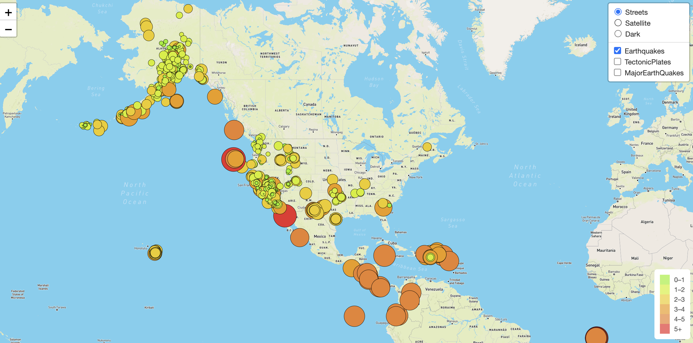
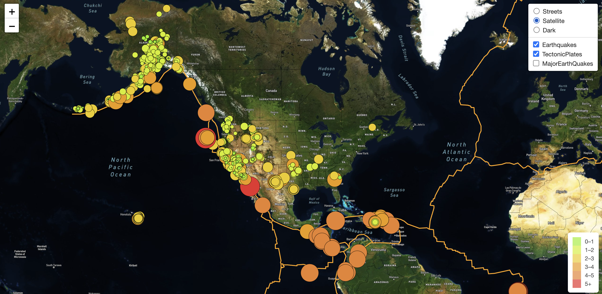
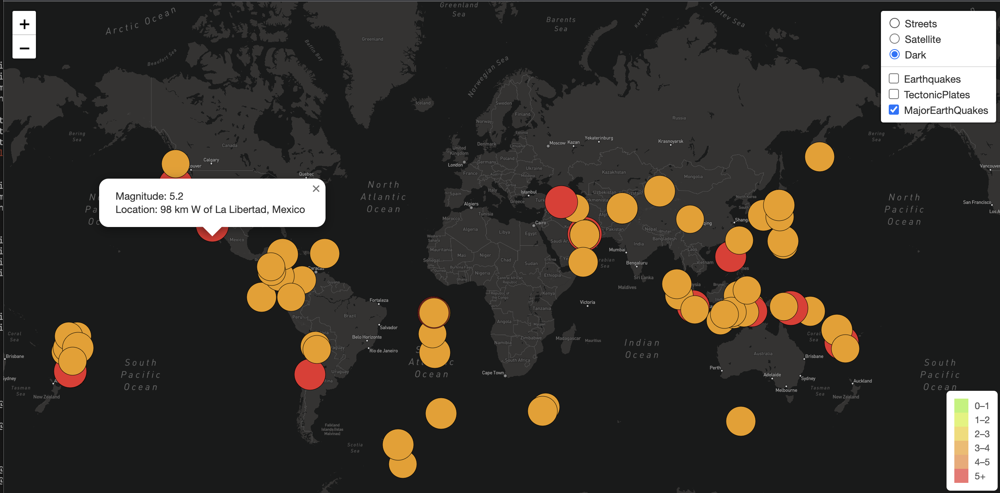
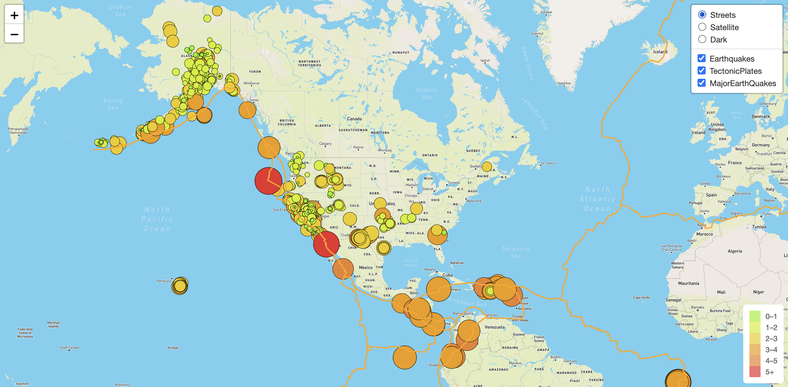

# Earthquake Analysis

## Overview of the Project

The purpose of this project is to visually show the differences between the magnitudes of earthquakes all over the world for the last seven days using the earthquake data from USGS website.

In addition to all earthquakes a data set of tectonic plates and major earthquakes needs to be added to better visualize the details across the world.

## Resources
- Data Source: Data from USGS website and tectonicplates data from a git repo.
- Software: Python 3.9.7, Visual Code, javascript, html, Mapbox, Leaflets
---

## Results

An initial layer of all earthquake data was put with color and radius based on the magnitue of the earthquake. A legend was added to map the color the magnitude.

A sample image in street mode:

The tectonic plates were layered on top of the earthquake data. A sample image in satellite mode:

Major earthquake data was added as another layer with popups. Sample image in dark mode:

By default on page load all layers are enabled in a single view:

---

## Summary

All the data was enabled for analysis and based on latest updates from the usgs website the data will reflect automatically for the teams analysis and research.